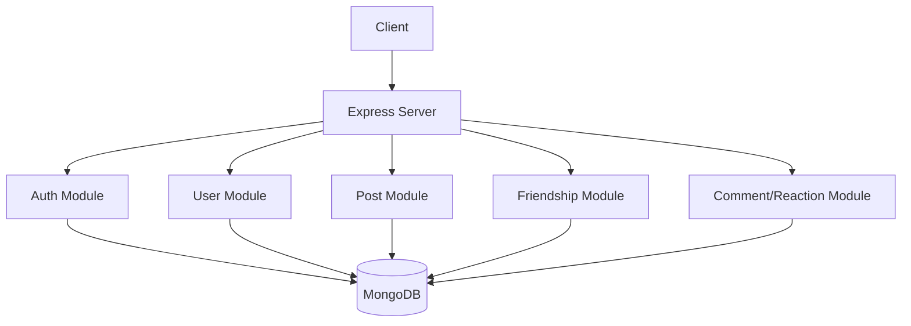

## 🏷️ Badges


# Social Media Platform API

A scalable, modular, and production-ready **Node.js + Express + TypeScript** social media backend. The system supports authentication, posts, reactions, mentions, friendships, blocking, and more — built with clean architecture principles and fully validated using **Zod**.

This project is suitable for real-world deployment and strong enough to display on your CV or GitHub portfolio.

---

## 🚀 Features

### 🔐 Authentication & Authorization
- JWT-based authentication
- Global `isAuthenticated` middleware
- Zod-powered request validation

### 👤 User Module
- Get profile
- Send friend requests
- Accept/decline requests
- Unfriend functionality
- Block system
- Friend list management

### 📝 Post Module
- Create posts with mentions
- Soft delete (freeze) and restore posts
- Add reactions (Like, Love, etc.)
- Populate author and reaction users
- Email notifications when mentioned

### 💬 Reactions
- Add/remove/update reactions on posts
- Validated using enums

### 📝 Comments (if included)
- Nested comment structure
- Parent ID support

### 🔒 Validation
- Global `isValid` middleware using Zod
- Strong typed DTOs
- Clean and reusable validators

### ✉️ Email Notifications
- Email service used for mentions
- Dynamic HTML email support

### 🏗 Architecture
- Modular structure
- Repository layer for DB operations
- Services for business logic
- Middlewares for authentication & validation
- DTO + Factory pattern inside post module
- Soft delete system

---

## 🛠 Tech Stack
- **Node.js**
- **Express.js**
- **TypeScript**
- **MongoDB + Mongoose**
- **Zod**
- **JWT**
- **Nodemailer** (email notifications)

---

## 📂 Project Structure
```
src/
│── DB/
│   ├── model/
│   ├── repositories/
│   └── index.ts
│
│── modules/
│   ├── user/
│   │   ├── user.service.ts
│   │   ├── user.controller.ts
│   │   └── user.routes.ts
│   │
│   ├── post/
│   │   ├── post.dto.ts
│   │   ├── post.service.ts
│   │   ├── factory/
│   │   └── post.routes.ts
│
│── middleware/
│   ├── isAuthenticated.ts
│   └── isValid.ts
│
│── utils/
│   ├── exceptions/
│   ├── token.ts
│   ├── constants.ts
│   ├── email.ts
│   └── enums.ts
│
│── server.ts
```

---

## 📌 Installation
```bash
git clone <your-repo-url>
cd project-name
npm install
```

---

## ▶️ Running the Project
```bash
npm run dev
```

Build for production:
```bash
npm run build
npm start
```

---

## 🔑 Environment Variables
Create a `.env` file:
```
PORT=4000
MONGO_URI=your_mongodb_uri
JWT_SECRET=your_secret_key
EMAIL_USER=your_email
EMAIL_PASS=your_password
```

---

## 📬 API Endpoints (Quick Overview)
### **Auth**
- `POST /auth/signup`
- `POST /auth/login`

### **User**
- `GET /user/profile`
- `POST /user/add-friend`
- `POST /user/accept-request`
- `DELETE /user/unfriend/:id`
- `POST /user/block`

### **Post**
- `POST /post/create`
- `GET /post/:id`
- `POST /post/react/:id`
- `DELETE /post/:id`
- `POST /post/freeze/:id`
- `POST /post/unfreeze/:id`
- `PATCH /post/:id`

---

## 🧪 Validation (Zod)
This project includes a global validation middleware:
```ts
export const isValid = (schema: ZodType) => { ... }
```
Usage example:
```ts
router.post("/create", isValid(createPostSchema), postController.create);
```
---

## 📈 Future Improvements (Optional for Growth)
- Add WebSockets for real‑time notifications
- Add comment system with replies
- GraphQL API version
- Rate limiting & caching (Redis)
- Docker support
- Unit tests using Jest

---

## 🤝 Contributing
Pull requests are welcome! For major changes, please open an issue first.

---

## 📄 License
MIT License

---

## ⭐ Support the Project
If you like this project, consider giving it a **⭐ on GitHub**.

---

## 🧩 System Architecture Diagram
(You can replace this with an actual diagram image)
```
[ Application Layer ]
        ↓
[ Controller Layer ]
        ↓
[ Service Layer ]
        ↓
[ Repository Layer ]
        ↓
[ MongoDB Database ]
```

---

## 📘 Detailed API Documentation

### 🔐 Authentication
| Method | Endpoint | Description |
|--------|----------|-------------|
| POST | /auth/signup | Register new user |
| POST | /auth/login | Authenticate user |

### 👤 User Module
| Method | Endpoint | Description |
|--------|----------|-------------|
| GET | /user/profile | Get logged‑in user profile |
| POST | /user/add-friend | Send a friend request |
| POST | /user/accept-request | Accept a friend request |
| DELETE | /user/unfriend/:id | Remove a friend |
| POST | /user/block | Block a user |

### 📝 Post Module
| Method | Endpoint | Description |
|--------|----------|-------------|
| POST | /post/create | Create a new post |
| GET | /post/:id | Get post by ID |
| POST | /post/react/:id | React to a post |
| DELETE | /post/:id | Soft delete a post |
| POST | /post/freeze/:id | Freeze a post |
| POST | /post/unfreeze/:id | Unfreeze a post |
| PATCH | /post/:id | Update post |

---

## 🖼️ Project Banner
<p align="center">
  
</p>

## 🗺️ System Architecture Diagram



---

## 🛠️ Deployment Instructions

### 1️⃣ Clone the Repository
```bash
git clone <your-repo-url>
cd project-folder
```

### 2️⃣ Install Dependencies
```bash
npm install
```

### 3️⃣ Setup Environment Variables
Create a `.env` file:
```
PORT=4000
MONGO_URI=your_mongodb_atlas_url
JWT_SECRET=your_secret_key
EMAIL_USER=your_email
EMAIL_PASS=your_email_password
```

### 4️⃣ Start the Server
Development mode:
```bash
npm run dev
```
Production mode:
```bash
npm run build
npm start
```


